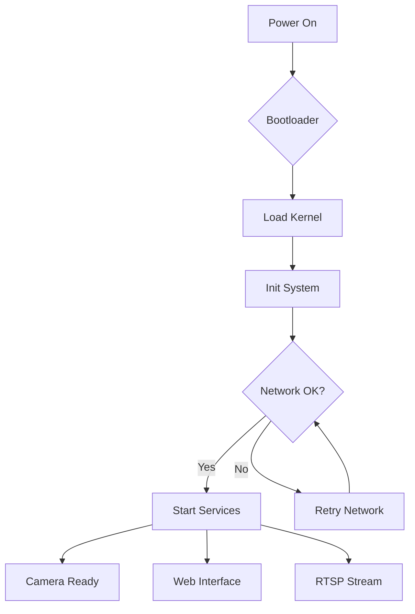

## Sandbox

```mermaid
flowchart TD
    A[Power On] --> B{Bootloader}
    B --> C[Load Kernel]
    C --> D[Init System]
    D --> E{Network OK?}
    E -- Yes --> F[Start Services]
    E -- No --> G[Retry Network]
    G --> E
    F --> H[Camera Ready]
    F --> I[Web Interface]
    F --> J[RTSP Stream]
```
