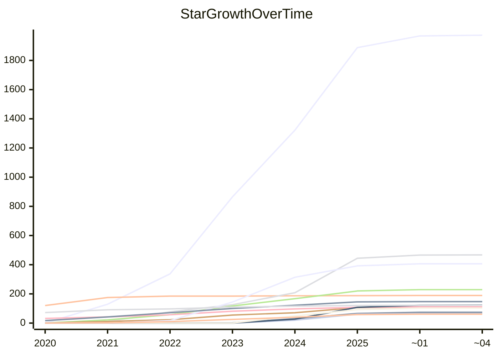
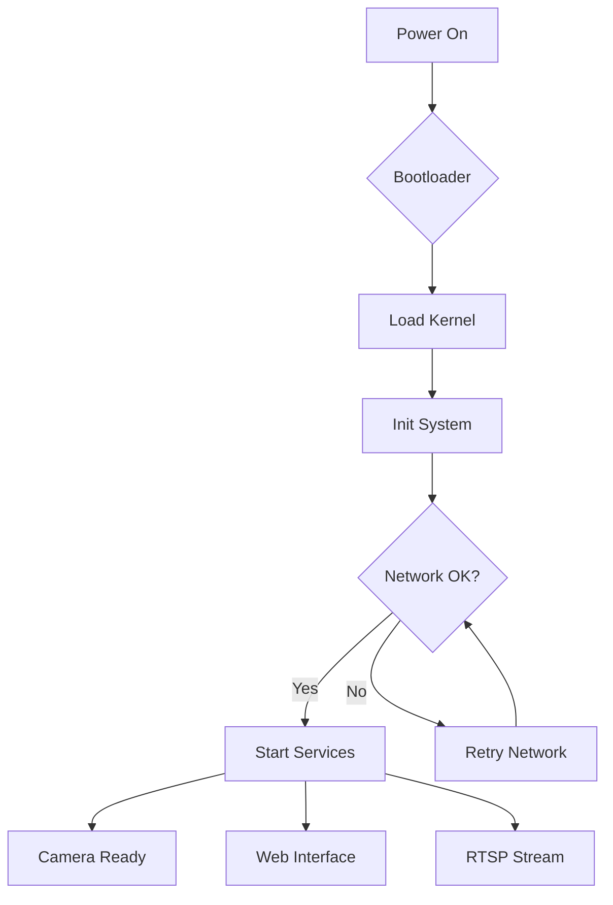

## Sandbox

```mermaid
xychart-beta
    title Star Growth Over Time
    x-axis ["2020", "2021", "2022", "2023", "2024", "2025", "~01", "~04"]
    line [0, 129, 337, 865, 1322, 1888, 1968, 1973]
    line [0, 0, 0, 2, 30, 66, 74, 74]
    line [120, 175, 185, 185, 187, 188, 189, 189]
    line [4, 11, 77, 126, 208, 444, 466, 467]
    line [0, 22, 57, 117, 167, 220, 229, 229]
    line [0, 11, 23, 55, 71, 106, 110, 110]
    line [0, 0, 0, 0, 20, 61, 65, 65]
    line [32, 42, 57, 81, 97, 108, 111, 111]
    line [0, 0, 0, 0, 27, 108, 122, 123]
    line [0, 0, 0, 0, 49, 92, 103, 103]
    line [0, 0, 17, 144, 314, 392, 406, 406]
    line [17, 42, 71, 100, 122, 145, 147, 147]
    line [0, 2, 10, 25, 40, 58, 61, 61]
    line [72, 91, 97, 109, 116, 121, 122, 122]
```

```mermaid
flowchart TD
    A[Power On] --> B{Bootloader}
    B --> C[Load Kernel]
    C --> D[Init System]
    D --> E{Network OK?}
    E -- Yes --> F[Start Services]
    E -- No --> G[Retry Network]
    G --> E
    F --> H[Camera Ready]
    F --> I[Web Interface]
    F --> J[RTSP Stream]
```
